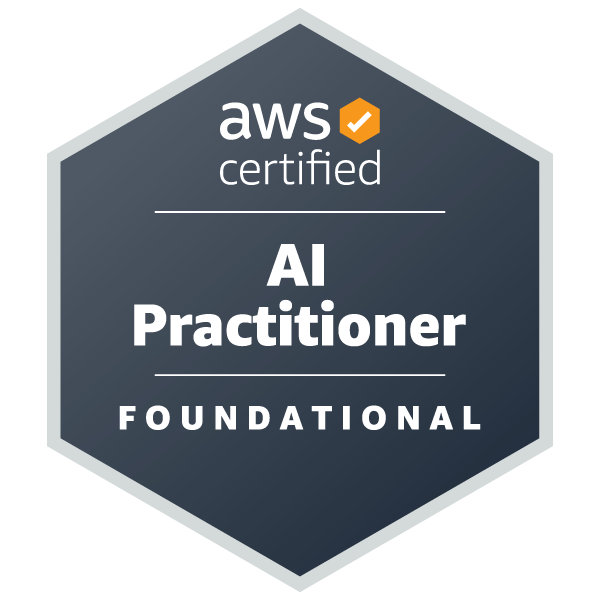

<div align="center">

<!-- Animated typing header -->
<a href="https://github.com/BBaykhan">
  
</a>

<br/>

**System Engineer & Builder** — apps, integrations, pipelines, and everything in between 🛠️

📍 Tokyo, Japan &nbsp;|&nbsp; 🗣️ English / 日本語 / Russian

</div>

---

## 🧙 About Me

- 🔭 I'm a **system engineer** at a retail brand operating across Japan, Korea, UK, Taiwan, and Hong Kong — one day I'm building an internal web app, the next I'm untangling an API integration or fixing a broken pipeline
- 🏗️ Currently building an **in-house daily report sharing platform** on AWS Amplify Gen 2 for ~1,000 employees, replacing a paid SaaS subscription
- 🧩 My toolbox spans **app development, system integration, AWS infrastructure, and SQL analytics** — whatever the problem needs
- 🕵️ My favorite kind of work: **deep-dive investigations** — tracing bugs across multiple systems until the root cause has nowhere left to hide
- 📜 **AWS Certified AI Practitioner** — Cloud Practitioner exam booked, Solutions Architect Associate next
- 🌱 Always leveling up toward **full-stack magician** status ✨

---

## 🏅 Certifications

<div align="center">

<a href="https://skillsprofile.skillbuilder.aws/user/baykhanbob">
  
</a>

<br/>

**AWS Certified AI Practitioner**

<br/>

**On the way ⬇️**


<br/>

[](https://skillsprofile.skillbuilder.aws/user/baykhanbob)

</div>

---

## 🛠️ Tech Stack

### Languages


### App Development


### Cloud & Infrastructure


### Data & Databases


### APIs & Platforms


---

## 🚀 Featured Project

### 📣 Internal Daily Report Sharing Platform &nbsp;·&nbsp; 

A company-wide platform for **~1,000 employees** to share daily summaries and updates — built in-house to replace a paid third-party SaaS subscription with something better fitted to how the company actually works.

**What I'm building:**

- 🔐 **Enterprise auth** — Cognito user pools with Google OAuth and Microsoft 365 single sign-on, restricted so only company accounts can register
- 👥 **Org-aware access control** — Cognito group-based roles, department/group filtering, and content visibility rules that follow the organizational hierarchy
- 📝 **Rich posts** — rich-text editing, media uploads to S3 with progress tracking, comments and reactions, and a per-post "who has seen this" reader list
- ⚡ **Real-time by design** — GraphQL API on AppSync over DynamoDB, so feeds and notifications stay live
- 🛠️ **Admin dashboard** — user and permission management, content moderation, and usage analytics
- 📱 **Mobile next** — React Native apps for iOS and Android sharing the same backend, with push notifications via FCM/APNs and native camera and gallery integration, distributed privately through enterprise app channels

**Stack:** AWS Amplify Gen 2 · React · TypeScript · Vite · AppSync (GraphQL) · DynamoDB · Cognito · S3 · React Native

---

## 💼 Other Work Highlights

| 🧱 Project | ⚙️ What it does | 🔧 Stack |
|---|---|---|
| **Warehouse Inventory Desktop App** 📦 | Two-in-one internal tool used daily by two teams, shipped to Windows machines as a packaged executable with self-updating builds. **CSV Viewer** *(in use)*: read-only browser over years of archived warehouse data covering every domestic inbound and outbound movement — online customer orders and shipments plus deliveries to all physical stores. Config-driven folder definitions, cross-history search backed by S3-event Lambdas that maintain per-folder indexes, product-code conversion against master data, and styled Excel/CSV export. **Store Allocation (店舗売り分け)** *(in development)*: replaces a large legacy Excel macro system, allocating stock across store-to-warehouse shipments for domestic **and** international stores against each country's own warehouses — merging SQL Server, warehouse spreadsheets, e-gift orders, and pending deliveries into a single grid. Access and export events logged to DynamoDB | Python · Streamlit · PyInstaller · S3 · Lambda · DynamoDB · SQL Server |
| **Reward Item Management App** 🎁 | Internal web app for managing customer benefit/reward items on the ebisumart e-commerce platform. Reward items load dynamically from the product catalog by category code, so staff can add new items with zero code changes — replacing a hardcoded item list | PHP · JavaScript · ebisumart · MySQL |
| **Membership Rank System** | Core maintainer of the system behind a multi-country loyalty rank program — tier calculations, per-currency thresholds, and full-history rank recalculation from raw transactions | Redshift · dbt · SQL Server · Fivetran |
| **Cross-System Bug Investigations** | Led multi-phase investigations to find and remediate customers affected by rank calculation bugs across e-commerce, POS, and CDP systems | SQL · Redshift · SQL Server · Shopify data |
| **Serverless File Pipelines** | Event-driven Lambda pipelines for CSV/XLSX processing, S3 file routing, error-folder handling, and SNS notifications | Python · Lambda · S3 · EventBridge · SNS |
| **CDC & Replication Ops** | Diagnosed and fixed SQL Server CDC capture failures, set up PostgreSQL logical replication into Redshift, and tamed sync costs on large tables | SQL Server CDC · Fivetran · PostgreSQL · AWS DMS |
| **Secure Data Sharing** | Designed KMS key policies and restrictive S3 bucket policies for safe cross-account vendor data delivery | KMS · S3 · IAM · Redshift UNLOAD |
| **Retail Ops Automation** | Excel/VBA tooling for order backlog forecasting and multi-store delivery planning across domestic and international retail stores — the legacy system the store allocation tool above is built to replace | VBA · Excel · SQL |

---

## 🧠 Things I'm Good At

```text
🏗️ Full-stack delivery     — from Cognito auth flows to GraphQL schemas to the UI on top
🔍 Root-cause analysis      — following a bug through 3+ systems until the "why" is airtight
🔌 System integration       — APIs, webhooks, vendor platforms, and the glue code between them
🧮 Complex SQL              — window functions, anti-joins, cross-database reconciliation
🌏 Multi-region systems     — currencies, timezones (JST!), CJK encodings, country-specific logic
🚒 Production firefighting  — CDC outages, broken S3 events, replication conflicts, ERP replacement, EC site replacement
🤝 Vendor communication     — writing clear technical bug reports (in English and Japanese)
```

---

## 📊 GitHub Stats

<div align="center">


<br/><br/>


</div>

---

## 🤝 Let's Connect

<div align="center">

[](https://www.linkedin.com/in/bobirjon-boykhonov-706181304/)
[](mailto:Bobur.Baykhanov@gmail.com)

<br/>


<br/><br/>

*"Can we fix it? Yes we can!"* 🔨✨

</div>
